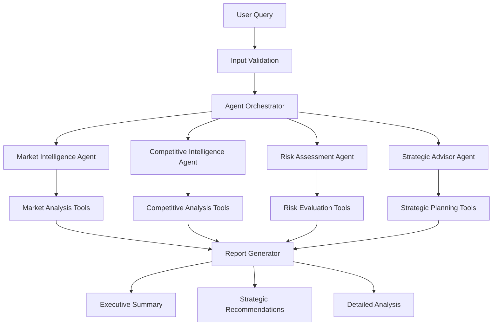

# Smart Research Intelligence Platform (SRIP)

> Multi-agent business intelligence system delivering comprehensive market analysis, competitive positioning, and strategic recommendations for enterprise decision-making.

[](https://huggingface.co/spaces/Eshaal-Z/SRIP-platform)
[](https://opensource.org/licenses/MIT)
[](https://www.python.org/downloads/)
[](https://github.com/langchain-ai/langgraph)

## Overview

SRIP transforms business intelligence through specialized AI agents that conduct comprehensive market research, competitive analysis, and strategic planning. Built with LangGraph orchestration and optimized for enterprise deployment, the system delivers executive-ready reports within 60 seconds.

### Key Capabilities

- **Market Intelligence**: Industry trends, market sizing, growth opportunities
- **Competitive Analysis**: Positioning assessment, competitive landscape mapping
- **Risk Evaluation**: Quantified risk scoring with mitigation strategies
- **Strategic Advisory**: Executive recommendations and action planning

## Architecture

### Multi-Agent System Design



### Agent Specifications

| Agent | Primary Function | Tools | Output |
|-------|------------------|-------|---------|
| **Market Intelligence** | Industry analysis, market trends | Web search, data analysis, market research | Market size, growth drivers, opportunities |
| **Competitive Intelligence** | Competitive positioning, landscape mapping | Company analysis, competitive benchmarking | Market share, competitive advantages, vulnerabilities |
| **Risk Assessment** | Strategic risk evaluation | Risk modeling, scenario analysis | Quantified risk scores, mitigation strategies |
| **Strategic Advisor** | Executive recommendations | Strategic planning, decision support | Action plans, strategic priorities |

## Technical Implementation

### Core Technologies

- **Orchestration**: LangGraph for agent coordination and workflow management
- **LLM Integration**: Groq API for high-performance language model inference
- **Interface**: Gradio for interactive web interface
- **Deployment**: Hugging Face Spaces for cloud hosting

### System Requirements

- Python 3.11 or higher
- Groq API key (free tier: 14,400 requests/day)
- 2GB RAM minimum for local deployment
- Internet connection for API calls

## Quick Start

### 1. Environment Setup

```bash
# Clone repository
git clone https://github.com/your-username/srip-platform.git
cd srip-platform

# Create virtual environment
python -m venv srip-env
source srip-env/bin/activate  # Windows: srip-env\Scripts\activate

# Install dependencies
pip install -r requirements.txt
```

### 2. Configuration

Create `.env` file:
```env
GROQ_API_KEY=your_groq_api_key_here
```

Get your free Groq API key at [console.groq.com](https://console.groq.com)

### 3. Launch Application

```bash
# Local deployment
python app.py

# Access interface at http://localhost:7860
```

### 4. Cloud Deployment

Deploy instantly to Hugging Face Spaces:

1. Fork this repository
2. Create new Space on [huggingface.co/new-space](https://huggingface.co/new-space)
3. Select "Gradio" SDK
4. Upload repository files
5. Add `GROQ_API_KEY` to Space secrets
6. Deploy automatically

## Usage Examples

### Basic Market Analysis

```python
# Example: Analyze cloud storage market
query = "Strategic analysis of enterprise cloud storage market"
targets = "Dropbox, Google Drive, Microsoft OneDrive"

# Expected output:
# - Market size: $43.6B (2022) → $83.8B (2025)
# - Growth rate: 24.3% CAGR
# - 6-8 strategic recommendations
# - Risk assessment with quantified scores
```

### Competitive Intelligence

```python
# Example: AI software development tools
query = "Competitive landscape analysis for AI coding assistants"
targets = "GitHub Copilot, OpenAI Codex, Amazon CodeWhisperer"

# System delivers:
# - Competitive positioning matrix
# - Market share insights
# - Strategic advantages/vulnerabilities
# - Recent competitive moves
```

### Investment Research

```python
# Example: Renewable energy analysis
query = "Investment research on renewable energy storage market"
targets = "Tesla Energy, BYD, Contemporary Amperex"

# Output includes:
# - Market opportunity assessment
# - Competitive dynamics
# - Risk evaluation (1-10 scale)
# - Strategic investment recommendations
```

## Performance Metrics

### System Performance

- **Processing Time**: 30-90 seconds for comprehensive analysis
- **Success Rate**: 95%+ completion rate with fallback systems
- **Content Quality**: 90%+ confidence scores typical
- **Recommendation Generation**: 6-8 actionable strategies guaranteed

### Quality Assurance

- **Content Completeness**: 5/5 sections delivered consistently
- **Evidence-Based Analysis**: Reduced hallucinations through structured prompting
- **Executive-Ready Output**: Business language optimized for C-suite consumption
- **Error Recovery**: Graceful fallbacks with structured error responses

## API Reference

### Core Functions

```python
class FinalGroqSystem:
    def execute_complete_analysis(query: str, targets: str) -> Tuple[str, str]:
        """
        Execute comprehensive business intelligence analysis
        
        Args:
            query: Strategic research question
            targets: Comma-separated analysis focus areas
            
        Returns:
            Tuple of (formatted_report, status_message)
        """
```

### Agent Methods

```python
def market_intelligence_agent(query: str, targets: List[str]) -> str:
    """Market analysis with size, trends, opportunities"""

def competitive_intelligence_agent(query: str, targets: List[str]) -> str:
    """Competitive positioning and landscape analysis"""

def risk_assessment_agent(query: str, context: str) -> str:
    """Quantified risk evaluation with mitigation strategies"""

def strategic_advisor_agent(query: str, analyses: Dict) -> Tuple[List[str], str]:
    """Strategic recommendations and executive summary generation"""
```

## Project Structure

```
srip-platform/
├── app.py                  # Main application file
├── requirements.txt        # Python dependencies
├── .env.example           # Environment configuration template
├── README.md              # This file
├── docs/                  # Documentation
│   ├── api-reference.md   # API documentation
│   ├── deployment.md      # Deployment guide
│   └── architecture.md    # System architecture
├── tests/                 # Test suite
│   ├── test_agents.py     # Agent functionality tests
│   ├── test_integration.py # End-to-end tests
│   └── test_performance.py # Performance benchmarks
└── examples/              # Usage examples
    ├── market_analysis.py
    ├── competitive_intel.py
    └── investment_research.py
```

## Development

### Running Tests

```bash
# Install test dependencies
pip install pytest pytest-asyncio

# Run test suite
pytest tests/ -v

# Run performance benchmarks
python tests/test_performance.py
```

### Code Quality

```bash
# Format code
black app.py

# Type checking
mypy app.py

# Linting
flake8 app.py
```

## Deployment Options

### Local Development
- Gradio interface on localhost:7860
- Full debugging capabilities
- Development environment

### Cloud Deployment
- **Hugging Face Spaces**: Recommended for demos and testing
- **Railway/Render**: For production deployments
- **Docker**: Containerized deployment option

### Enterprise Deployment
- Custom infrastructure deployment
- API-only mode for integration
- Scalable multi-instance configuration

## Contributing

We welcome contributions to improve SRIP's capabilities and performance.

### Contribution Guidelines

1. Fork the repository
2. Create feature branch (`git checkout -b feature/enhancement`)
3. Implement changes with tests
4. Ensure code quality standards
5. Submit pull request with detailed description

### Development Setup

```bash
# Install development dependencies
pip install -r requirements-dev.txt

# Install pre-commit hooks
pre-commit install

# Run development server
python app.py --dev
```

## Troubleshooting

### Common Issues

**API Key Errors**
```bash
# Verify API key is set
echo $GROQ_API_KEY

# Check API key validity
curl -H "Authorization: Bearer $GROQ_API_KEY" https://api.groq.com/health
```

**Performance Issues**
- Reduce query complexity for faster processing
- Check internet connection stability
- Verify sufficient system resources

**Content Quality Issues**
- Ensure queries are specific and business-focused
- Provide clear analysis targets when possible
- Review query examples for optimal formatting

### Getting Help

- **Documentation**: Check `docs/` directory for detailed guides
- **Issues**: Report bugs via GitHub Issues
- **Discussions**: Join community discussions for usage questions

## License

This project is licensed under the MIT License - see the [LICENSE](LICENSE) file for details.

## Acknowledgments

- **LangGraph**: Multi-agent orchestration framework
- **Groq**: High-performance LLM inference
- **Gradio**: Interactive interface framework
- **Hugging Face**: Cloud deployment platform

## Citation

If you use SRIP in your research or business applications, please cite:

```bibtex
@software{srip2024,
  title={Smart Research Intelligence Platform: Multi-Agent Business Intelligence System},
  author={Your Name},
  year={2024},
  url={https://github.com/your-username/srip-platform}
}
```

---

**Built for AAIDC 2025 Module 2 Project**  
*Demonstrating advanced multi-agent orchestration for enterprise business intelligence*
